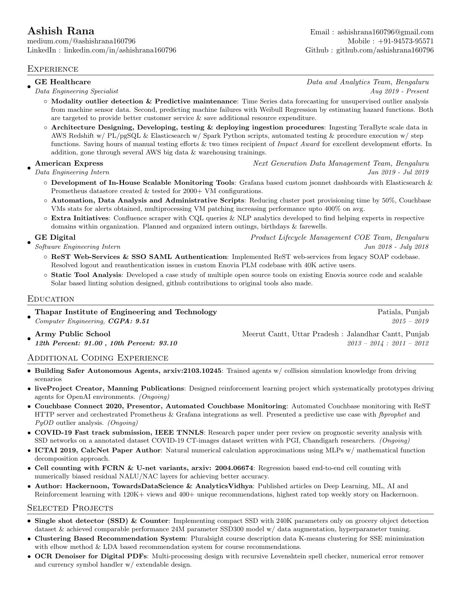
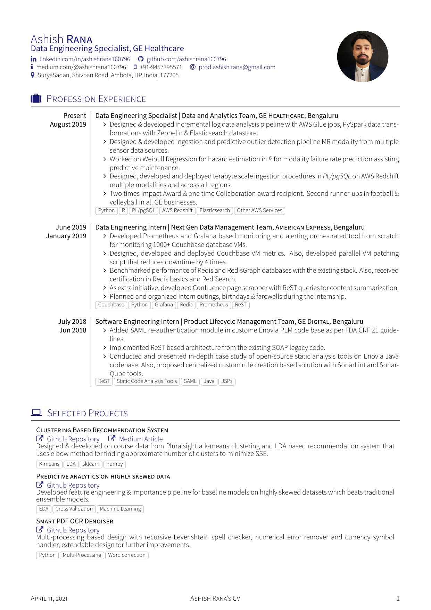
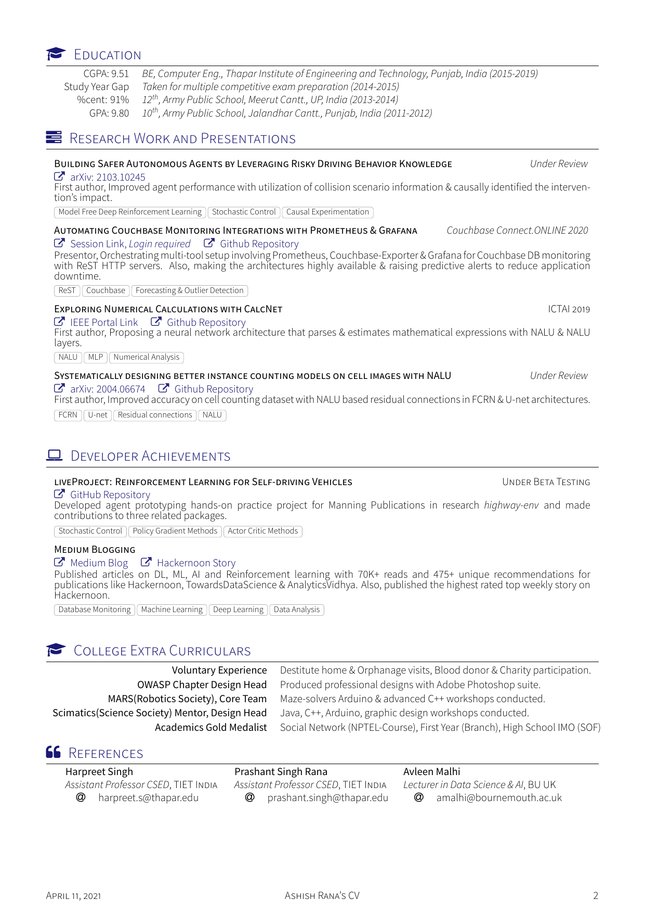

## Resume and Curriculum vitae Iterations for a human: Ashish Rana

This repository contains single column resume and two column CV latex code with necessary comments to get you started with your resume/CV development work for job/masters application. Also, I have provided the links to awesome project repositories that originally developed these projects. My contribution with this repository is to provide assistive comments and instructions. So, that you can get started with your resume building process pretty fast.

The latex code is _Unlicensed_ as it's completely borrowed from the below referenced repository with minor practical changes in the latex code for my use.

  
   
   	
  <b><em>Left:</em></b> single page & single column resume, <b><em>Center & Right:</em></b> dual column curriculum vitae

 

## Original Latex code Credits

I have altered the code as per my requirements and have added comments in latex code as well for more simple editing experience. But, in case you are interested in working with the original latex source code.

*  for latex code in single column resume format. It's taken from original latex format code written by .
*  for latex code in two column cv format. It's taken from original latex format code written by .

## Getting quickly started with latex resume editing

Instead of setting up the whole latex setup and spending on installing all required packages. First, login to the  website and then upload all the files in a newly created blank project. Overleaf is a very easy to use website for latex project development and would save a lot of time while working on any latex projects in future as well.

Second, for single column latex code resume open the `.tex` file containing the latex resume code and follow along the base comments for editing your resume.

And for editing your two column CV, open the project on overleaf with all the uploaded files & edit the respective `.tex` files for each section of the CV with the assistive comments provided in each section file for reference.

__Note:__ The sections in both latex resume and two column CV are specially arranged with respect to their text block sizes they occupy. Any change in the written text size or additional list point entry would disrupt the linear structure of resume/CV adding extra unnecessary whitespaces. Please, edit the section text and bullet points keeping this restructuring change in mind.
